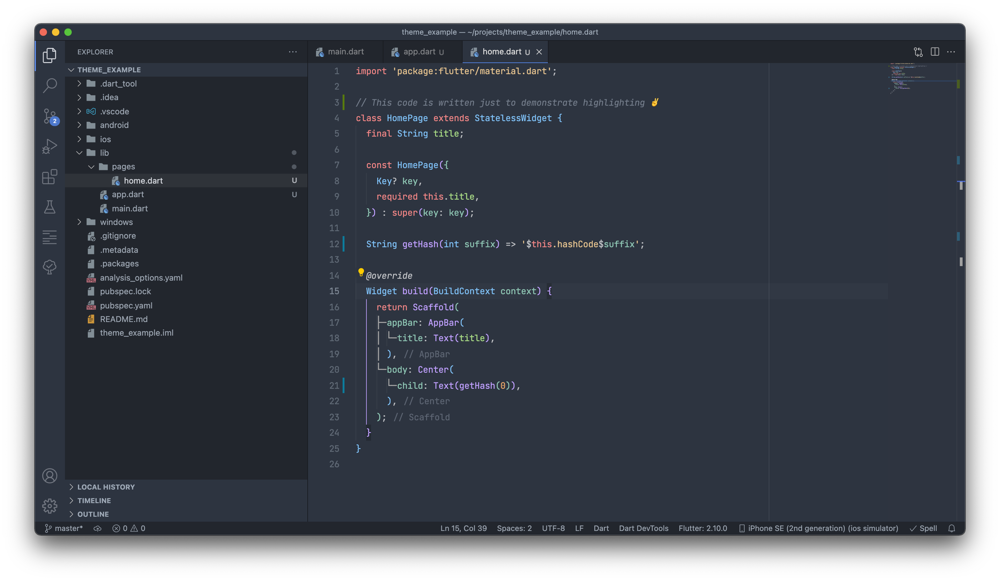

# OneCalm theme for VS Code.

Enjoy nice colors tailored for "calm" look and less distraction. Inspired by the great OneDark theme.

## Features:
- **Semantic highlighting to improve readability**

Clearly differentiate language structures in your code. Theme was originally developed to improve readability of `Flutter` code (`Dart` language), but it should be also compatible with other coding environments.
- **Easy on eyes**

Theme has medium contrast colors + dark palette, so it would not bother you during coding in low light conditions. Background is a little bit brighter than most of dark themes on marketplace, so any glares in daylight should be also eliminated.
- **Brackets highlighting**

Custom colors were applied for native vscode brackets highlighting. They will match main palette of theme

 

***Enjoy!***

 

## Credits

Big thanks to [Mark Skelton](https://github.com/mskelton) for his work on the theme
  this project was originally based on.
